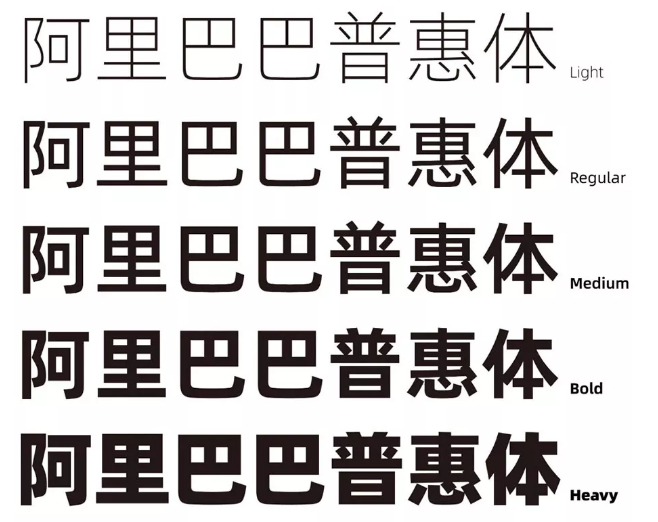

# 角点检测

SUSAN ( Small uni-value segment assimilating nucleus) 算子是一种基于灰度的特征点获取方法, 适用于图像中边缘和角点的检测, 可以去除图像中的噪声, 它具有简单、有效、抗噪声能力强、计算速度快的特点。SUSAN 可检测边缘点，角点，不需要计算微分。

## 1. 概述

SUSAN 算子的模板与常规卷积算法的正方形模板不同, 它采用一种近似圆形的模板, 用圆形模板在图像上移动, 模板内部每个图像像素点的灰度值都和模板中心像素的灰度值作比较, 若模板内某个像素的灰度与模板中心像素(核)灰度的差值小于一定值, 则认为该点与核具有相同(或相近)的灰度。

当圆形模板完全处在背景或目标中时，USAN 区域面积最大；当模板移向目标边缘时，USAN 区域逐渐变小；当模板中心处于边缘时，USAN 区域很小；当模板中心处于角点时，USAN 区域最小。

可以通过计算每1个像素的USAN值，并与设定的门限值进行比较，如果该像素的 USAN值小于门限值，则该点可以认为是1个边缘点。

SUSAN算法采用圆形模板，其目的是使检测达到各向同性；

在实际应用中，由于图像的数字化，无法实现真正的原型模板，往往采用近似圆代替；

圆形模板在图像上使用，模板内部每个图像像素点的灰度与模板中心像素的灰度进行比较；

若模板内某个像素的灰度与模板中心像素灰度的差值小于一定值，则认为该点与核具有相同或相似的灰度。

由满足这样条件的像素组成的区域称为核同值区(Univalue Segment Assimilation Nucleus,USAN);

当圆形模板完全在背景或目标中时，USAN区面积最大；

当圆形模板向边缘移动时，USAN区面积减少；

当圆心处于边缘时，USAN区面积很小；

当圆心在角点处时，USAN区面积最小；

故将图像每点上的USAN区面积作为该处特征的显著性度量，USAN区面积越小，特征越显著。

2.

## 2. 代码实现 [SUSAN.py](SUSAN.py)

> 参考：[https://blog.csdn.net/xiaohuolong1827/article/details/123698593](https://blog.csdn.net/xiaohuolong1827/article/details/123698593)

边缘检测、角点检测、重心计算、非极大值抑制

### 2.1 算法流程

#### 2.1.1 定义方法 - 圆形掩模

将一个半径为3.5，直径为7的圆形区域置为1，其余为0，实现一个圆形蒙版

```python
def get_susan_mask():
    mask = np.ones((7, 7))
    mask[0, 0] = 0
    mask[0, 1] = 0
    mask[0, 5] = 0
    mask[0, 6] = 0
    mask[1, 0] = 0
    mask[1, 6] = 0
    mask[5, 0] = 0
    mask[5, 6] = 0
    mask[6, 0] = 0
    mask[6, 1] = 0
    mask[6, 5] = 0
    mask[6, 6] = 0
    return mask
```

#### 2.1.2 定义方法 - SUSAN角点检测

1. 定义Susan算子模板，以及圆形mask，用于截取每个像素点的邻域内的像素值。
2. 依次遍历图像的每个像素点，对于每个像素点，取其周围的一个圆形区域，并使用mask截取该圆形区域内的像素值。
3. 计算该像素点与其邻域内的像素值的相似度，通过相似度来评估该像素点是否为边缘或角点。具体来说，计算相似度的方法是通过指数函数将差值映射到[0, 1]范围内，然后将相似度累加得到该像素点的角点得分。
4. 根据得分计算每个像素点是否为角点，返回角点得分矩阵R。

```python
def susan_corner_detect(img_src, t=10):
    susan_mask = get_susan_mask()
    img = img_src.copy()
    row_s, col_s = 3, 3
    row_e, col_e = img_src.shape[0] - 3, img.shape[1] - 3
    n_max = 0
    n_arr = 37 * np.ones(img.shape)  # 初始认为没有角点
    for r in range(row_s, row_e):  # 遍历所有行
        for c in range(col_s, col_e):  # 遍历所有列
            susan_zone = img[r - 3:r + 3 + 1, c - 3:c + 3 + 1]  # 获取矩形区域
            susan_zone = susan_zone[susan_mask != 0]  # 使用mask截取圆形区域
            r0 = img[r, c]
            similarity = np.exp(-((1.0 * susan_zone - r0) / t) ** 6)
            n = np.sum(similarity)
            if n > n_max:
                n_max = n
            n_arr[r, c] = n
    g = n_max / 2
    R = np.zeros(img.shape)
    index = n_arr < g  # 小于g，认为是可能的角点，越小，可能性越大
    R[index] = g - n_arr[index]  # 取反，所以R越大，是角点的可能性越大

    plt.figure()
    plt.title("edge")
    plt.imshow((6.37 * n_arr).astype(np.uint8), cmap=cm.gray)
    return R
```

#### 2.1.3 定义方法 - 重心法（去除那些不太可能是真实角点的点）

代码中的`x_label`和`y_label`分别代表`x`和`y`方向上的标签矩阵，用于计算重心的`x`和`y`坐标。

接下来，该函数首先对输入的图像和角点进行复制，然后遍历图像中的所有像素，对于每个角点，获取其周围的矩形区域，使用Susan算法中的掩模将其裁剪为圆形区域，计算该圆形区域中像素值与中心像素值的相似度，并计算圆形区域的重心坐标。

最后，对于距离重心的距离小于F的角点，将其视为非角点。该函数返回过滤后的角点。

```python
def gravity_filter(img_src, corner_src, t=10, F=1.5):
    x_label = np.zeros((7, 7))
    y_label = np.zeros((7, 7))
    x_label[:, 0] = -3
    x_label[:, 1] = -2
    x_label[:, 2] = -1
    x_label[:, -1] = 3
    x_label[:, -2] = 2
    x_label[:, -3] = 1
    y_label[0, :] = -3
    y_label[1, :] = -2
    y_label[2, :] = -1
    y_label[4, :] = 1
    y_label[5, :] = 2
    y_label[6, :] = 3
    print(x_label, "\r\n", y_label)  # 查看矩形区域内x、y轴信息

    img = img_src.copy()
    row_s, col_s = 3, 3
    row_e, col_e = img_src.shape[0] - 3, img.shape[1] - 3
    corner = corner_src.copy()
    susan_mask = get_susan_mask()
    for r in range(row_s, row_e):
        for c in range(col_s, col_e):
            if corner[r, c] == 0:  # 对于不是角点的位置，就没必要进行后续计算了
                continue
            susan_zone = img[r - 3:r + 3 + 1, c - 3:c + 3 + 1]  # 获取矩形区域
            r0 = img[r, c]
            similarity = np.exp(-((1.0 * susan_zone - r0) / t) ** 6)
            g_x = np.sum(similarity[susan_mask == 1] * x_label[susan_mask == 1]) / np.sum(
                similarity[susan_mask == 1])  # 使用mask截取圆形区域
            g_y = np.sum(similarity[susan_mask == 1] * y_label[susan_mask == 1]) / np.sum(
                similarity[susan_mask == 1])  # 使用mask截取圆形区域
            distance = np.sqrt(g_x ** 2 + g_y ** 2)
            if distance < F:
                corner[r, c] = 0
    return corner
```

#### 2.1.4 定义方法 - 非极大值抑制

输入参数`corner`是一个灰度图像的角点检测结果，`kernal`是抑制窗口的大小，默认为`3`。

代码首先将角点检测结果复制到变量`out`中，然后通过计算得到抑制窗口的起始行列位置`row_s`, `col_s`以及结束行列位置`row_e`, `col_e`。接下来，代码利用两层for循环遍历每个像素点，判断当前像素点是否为可能的角点（即`corner[r,c] != 0`），如果不是则跳过本次循环。

对于可能的角点，代码提取以该像素点为中心的大小为`kernal * kernal`的窗口，然后在该窗口中找到所有小于该像素点值的像素的位置，并将这些位置的像素值与该像素点的值进行比较。如果存在一个小于该像素点值的像素，则说明该像素点不是最大的，将其抑制，即将`out[r,c]`置为`0`；否则，该像素点为最大值，将`out[r,c]`置为`255`，表示该像素点为角点。

最终，函数返回经过非极大值抑制后的角点检测结果。

```python
def corner_nms(corner, kernal=3):
    out = corner.copy()
    row_s = int(kernal / 2)
    row_e = out.shape[0] - int(kernal / 2)
    col_s, col_e = int(kernal / 2), out.shape[1] - int(kernal / 2)
    for r in range(row_s, row_e):
        for c in range(col_s, col_e):
            if corner[r, c] == 0:  # 不是可能的角点
                continue
            zone = corner[r - int(kernal / 2):r + int(kernal / 2) + 1, c - int(kernal / 2):c + int(kernal / 2) + 1]
            index = corner[r, c] < zone
            (x, y) = np.where(index == True)
            if len(x) > 0:  # 说明corner[r,c]不是最大，直接归零将其抑制
                out[r, c] = 0
            else:
                out[r, c] = 255
    return out
```

#### 2.1.5 调用方法运行实例

```python
if __name__ == '__main__':
    img_src = cv2.imread('../../img/Eiffel-Tower.png', -1)
    if len(img_src.shape) == 3:
        img_src = cv2.cvtColor(img_src, cv2.COLOR_BGR2GRAY)
    corner = susan_corner_detect(img_src)

    img_show = cv2.cvtColor(img_src, cv2.COLOR_GRAY2BGR)
    img_show[corner != 0] = (255, 0, 0)
    plt.figure()
    plt.title("original corners")
    plt.imshow(img_show, cmap=cm.gray)

    cor_g = gravity_filter(img_src, corner)
    img_show2 = cv2.cvtColor(img_src, cv2.COLOR_GRAY2BGR)
    img_show2[cor_g != 0] = (255, 0, 0)
    plt.figure()
    plt.title("corners-gravity ")
    plt.imshow(img_show2, cmap=cm.gray)

    cor_g_nms = corner_nms(cor_g)
    img_show3 = cv2.cvtColor(img_src, cv2.COLOR_GRAY2BGR)
    img_show3[cor_g_nms != 0] = (255, 0, 0)
    plt.figure()
    plt.title("corners-gravity-nms ")
    plt.imshow(img_show3, cmap=cm.gray)
    plt.show()
```

### 2.2 测试用例



### 2.3 测试结果

